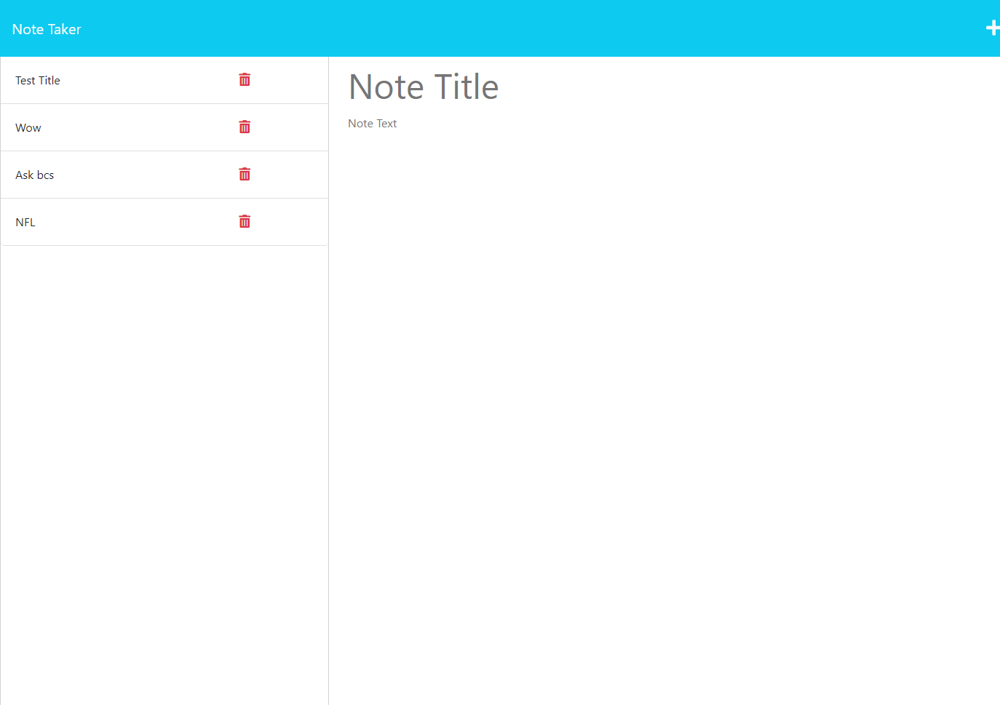

# Note Taking Application
  
  ## Table of Contents
  * [Description](#description)
  * [License](#license)
  * [Installation](#installation)
  * [Usage](#usage)
  * [Contributors](#contributors)
  * [Testing](#testing)
  * [Questions](#questions)
  * [MockUp](#mockup)
  ## Description
  Application that allows you to create notes, save, and delete them as you would like.
  ## License 
  Licensed under MIT license
  ## Installation
  N/A
  ## Usage:
  Json, javascript, node, express, heroku and markdown
  ## Contributors
  N/A
  ## Testing
  N/A
  ## Questions
  Please send your questions [here]:Maivory12@icloud.com 

  ## MockUp
 